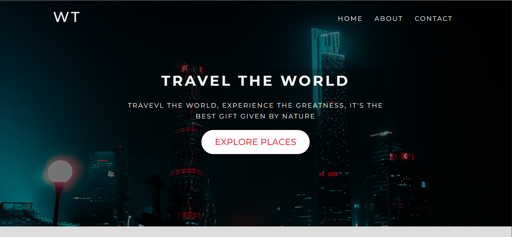
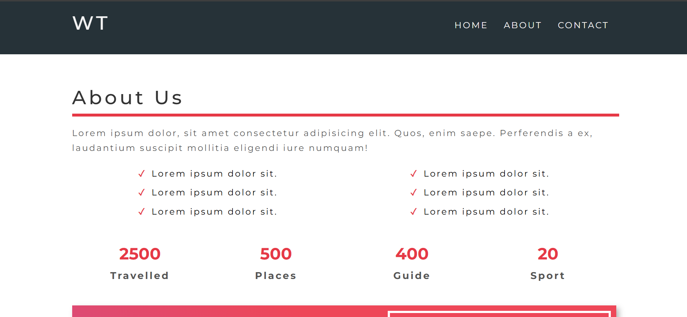
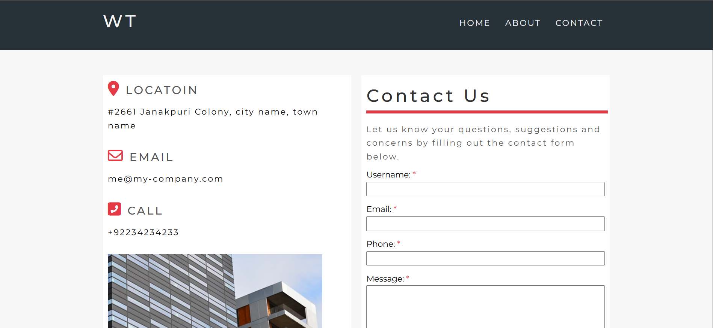

# ✈️ Travel Website

A responsive travel website built with pure HTML and CSS.

## 🌐 Live Demo

> https://muhammad-qasim-ali.github.io/travel-website/

## 📸 Screenshots

### 🏠 Home Page



### 👤 About Page



### 📞 Contact Page



## 📄 Pages

- **Home** — Main landing page with travel destinations
- **About** — About us page
- **Contact** — Contact form page

## 🛠️ Built With


## 🚀 How to Run

1. Clone the repo

```bash
   git clone https://github.com/Muhammad-Qasim-Ali/travel-website.git
```

2. Open `index.html` in your browser

## 👨‍💻 Author

**Muhammad Qasim**

- LinkedIn: [muhammad-qasim](https://linkedin.com/in/muhammad-qasim-17baa0292)
- Email: muhqasimali50@gmail.com
